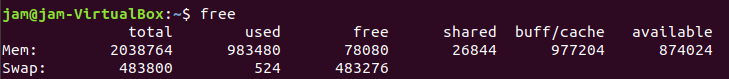
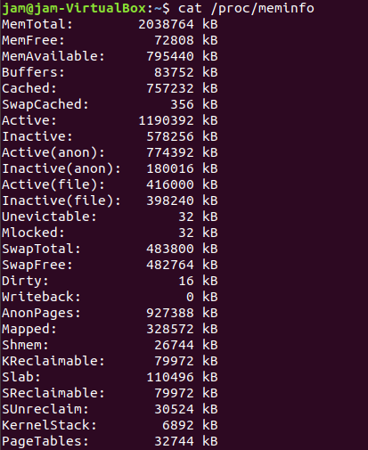
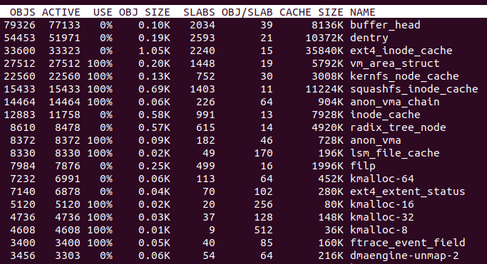

# 4.free 명령이 숨기고 있는 것들

## `free` 
- 리눅스 시스템의 메모리의 전체적인 현황을 살펴 볼 수 있는 명령어
- `free -m` : MB 단위로 메모리 정보 표시
> 메모리 : 프로세스가 연산할 수 있는 공간을 제공하는 리소스

#### free 명령어로 알 수 있는 정보들

- `Mem`  
    - `total` : 현재 시스템에 설치되어있는 전체 메모리 양   
    - `used` : 시스템에서 사용하고 있는 메모리 양  
    - `free` : 시스템에서 아직 사용하고 있지 않는 메모리 양   
    - `buff/cache` : 버퍼용도와 페이지 캐시라고 불리는 캐시영역에 있는 메모리 양 
- `Swap`
    - `total`: Swap 영역의 전체 용량
    - `used` : Swap 영역중 실제로 사용하고 있는 영역
    - `free` : Swap 영역중 사용하지 않은 영역에 대한 정보

###  buffers와 cached 영역
- 시스템의 I/O 성능 향상을 위해서 커널이 사용하는 영역이다.
> 커널은 상대적으로 느린 디스크에 대한 요청을 좀더 빠르게 하기 위해 메모리의 일부를 디스크 요청에 대한 캐싱 영역으로 할당해서 사용한다.  
한번 읽은 디스크의 내용을 메모리에 저장해 두어서, 동일한 내용을 읽고자 하면 디스크로 요청하지 않고 메모리로 요청하게 된다.  
이때 사용되는 캐싱 영역을 buffers, cached라고 부른다.

#### buffers와 cached 영역의 차이점
- cached  영역 : 파일의 내용을 저장하고 있는 캐시
- buffers 영역 : 파일 시스템의 메타데이터를 담고 있는 블록을 저장하고 있는 캐시

 > 메모리가 부족한 상황이 되면 커널은 해당 영역을 자동으로 반환한다. 
 > 그래서 free 명령에서는 해당 영역을 제외하고 실제 사용가능한 영역을 계산한다.

## `/proc/meminfo`
- 각 메모리가 시스템의 어느 부분에 사용되고 있는지 좀더 자세한 메모리 현황을 볼 수 있다.

- `SwapCached` : swap으로 빠진 메모리 영역 중 다시 메모리로 돌아온 영역을 의미한다.
    - > swap 영역으로 빠졌던 영역이 다시 메모리로 돌아가도 커널은 swap 영역에서 해당 메모리를 삭제하지 않고, 이 메모리 영역이
    다시 swap 영역으로 내려와야 하는 일이 생기면 swap영역으로 다시 복사하지 않고, 이전에 참고한 메모리 영역을 삭제하지 않고 다시 활용함으로써 
    swap이 발생하더라도 조금이나마 I/O를 줄일 수 있다.
- `Active(anon)` : 프로세스들이 사용하는 메모리 영역, 비교적 최근에 메모리 영역이 참조되어 swap영역으로 이동되지 않을 메모리 영역
- `Inactive(anon)` : 프로세스들이 사용하는 메모리 영역, 비교적 참조된지 오래어 swap 영역으로 이동될 수 있는 메모리 영역
- `Active(file)` : 커널이 I/O 성능 향상을 위해 사용하는 영역을 의미한다.(buffers와 cached영역)
                 비교적 최근까지 참조되어 swap영역으로 이동되지 않을 영역
- `Inactive(file)` : 커널이 I/O 성능 향상을 위해 커널이 캐시 목적으로 사용하고 있는 영역     
                 비교적 참조된지 오래되어 swap영역으로 이동될 수 있는 영역
- `Dirty` : I/O 성능 향알을 위해 커널이 캐시목적으로 사용하는 영역 중 쓰기 작업이 이루어져서 실제 블록 디바이스의 블록에 씌어져야 할 영역
- `Slab` : 메모리 영역중 커널이 직접 사용하는 영역
- `SReclaimable` : Slab영역중 재사용 될 수 있는 영역으로 캐시 용도로 사용하는 메모리들. 메모리 부족시 해제되어 프로세스에 할달 될 수 있다.
- `SUnreclaim` : Slab영역 중 재사용 될수 없는 영역으로 커널이 현재 사용하고 있는 영역을 말한다.
               

### Active와 Inactive를 구분하는 방법
1. 프로세스가 메모리 할당을 요청하고 해당 메모리의 페이지가 Active 리스트에 연결된다.
2. 메모리 할당이 실패하거나 메모리가 부족하게 되면 `kswapd`혹은 커널 내부에서 `try_to_free_pages()`함수를 통해서 LRU리스트에 있는 메모리들을 확인
3. Active리스트에 있던 페이지가 Inactive리스트로 옮겨가거나 Inactive 리스트에 있던 페이지가 해제되어 다른 프로세스에게 할당 

### Slab정보 좀더 자세하게 보기
- 메모리 영역중 커널이 직접 사용하는 영역을 Slab영역이라고 한다.
- slab할당자는 free 명령에서는 used로 계산된다.
- slab할당자는 각각의 목적에 맞는 캐시(dentry cache, inode cache)별로 영역을 할당 받아 사용한다.  
  이렇게 버디 시스템을 통해서 페이지 크기인 기본 4KB의 영역을 할당 받은 후에 각각의 캐시 크기에 맞게 영역을 나눠서 사용한다. 
  
#### `slabtop`

- dentry cache : 디렉터리의 계층 관계를 저장해 두는 캐시
- inode_cache : 파일의 inode에 대한 정보를 저장해 두는 캐시

- 메모리 점유율이 높아지는 원인이 프로세스가 아닌 Slab 메모리에 있는경우 `drop cache`를 이용해 캐시영역을 강제 플러싱 할 수 있다.
    - `echo 2 > /proc/sys/vm/drop_caches` : dentry cache 영역만 플러싱
    - `echo 3 > /proc/sys/vm/drop_caches` : dentry cache, page cache 모두 플러싱

